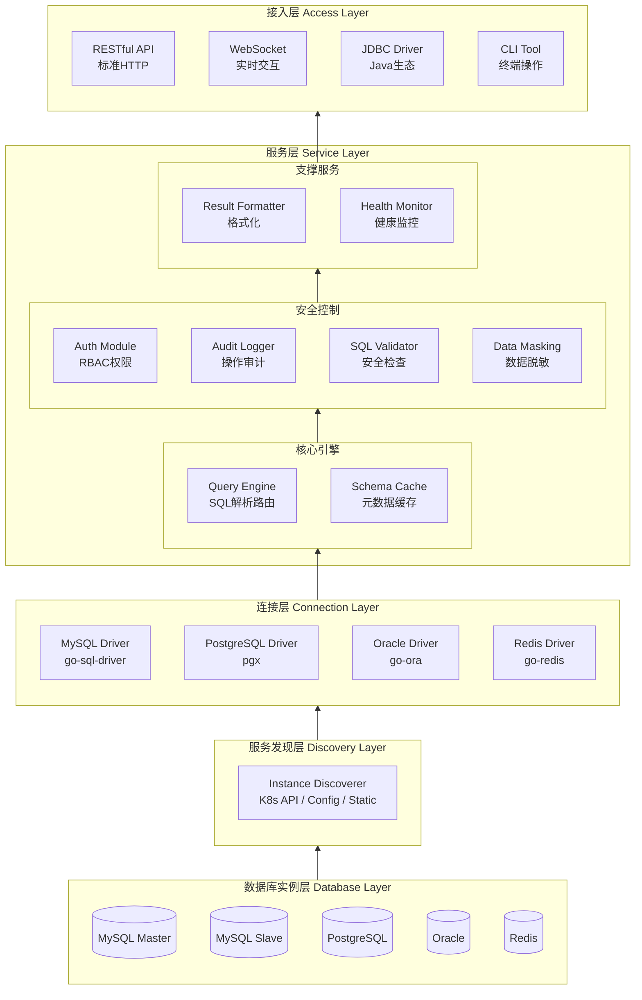

# MystiSql

面向 Kubernetes 集群的数据库访问网关。统一入口访问 MySQL、PostgreSQL、Oracle、Redis，支持 CLI / WebUI / REST API / WebSocket / JDBC 多种接入方式。

## 问题

- K8s 集群内数据库实例无法从外部直接访问
- 开发人员需要 port-forward 或 VPN 才能连接，配置复杂
- 运维人员无法在主机上直接巡检，集群内也缺少数据库 CLI 工具
- 每种数据库需要不同的客户端，管理成本高

## 核心价值

| 痛点场景 | 传统方案的局限 | MystiSql 的突破 |
|---------|--------------|---------------:|
| 开发调试 | port-forward / VPN，配置复杂 | 统一入口，一次配置，随处访问 |
| 运维巡检 | Pod 内安装各数据库 CLI | WebUI / CLI 双模式，零依赖访问 |
| 安全合规 | 直接暴露数据库端口有风险 | 集中管控，审计日志，权限控制 |
| 多数据库 | 每种数据库需要不同客户端 | 统一接口，屏蔽差异 |

## 快速开始

### 安装

```bash
git clone https://github.com/your-org/MystiSql.git
cd MystiSql
go build -o bin/mystisql ./cmd/mystisql
```

### 基础配置

创建 `config.yaml`：

```yaml
server:
  host: 0.0.0.0
  port: 8080
  mode: release

discovery:
  type: static

instances:
  - name: local-mysql
    type: mysql
    host: localhost
    port: 3306
    username: root
    password: root
    database: test
    labels:
      environment: development
```

详细配置说明 → [docs/config.md](docs/config.md)

### 基本使用

**REPL 交互模式（默认）：**

```bash
./bin/mystisql
# mystisql@local-mysql> SELECT * FROM users LIMIT 5;
```

**直接执行 SQL：**

```bash
./bin/mystisql query --instance local-mysql "SELECT * FROM users LIMIT 5"
```

**列出实例：**

```bash
./bin/mystisql instances list
```

**API 调用：**

```bash
curl http://localhost:8080/health
curl -X POST http://localhost:8080/api/v1/query \
  -H "Content-Type: application/json" \
  -d '{"instance": "local-mysql", "query": "SELECT 1"}'
```

## 架构概览



详细架构设计、安全架构、部署架构 → [docs/architecture.md](docs/architecture.md)

## 文档索引

| 文档 | 内容 |
|------|------|
| [架构设计](docs/architecture.md) | 整体架构、模块详解、安全架构、部署架构、技术栈、产品特性 |
| [配置说明](docs/config.md) | 配置文件结构、字段说明、环境变量覆盖、多环境配置示例 |
| [API 参考](docs/api-reference.md) | REST API 端点、认证、事务、批量操作、WebSocket、SDK 示例 |
| [E2E 测试](docs/testing.md) | 测试环境搭建、测试内容、CI/CD 集成、故障排查 |
| [开发路线](docs/roadmap.md) | Phase 规划、功能优先级矩阵、里程碑、OpenSpec 规格、JDBC 使用场景 |

## 技术栈

| 模块 | 技术选型 |
|-----|---------|
| Web 框架 | Gin / Fiber |
| 数据库驱动 | go-sql-driver/mysql, pgx, go-ora, go-redis |
| K8s 集成 | client-go |
| WebSocket | gorilla/websocket |
| CLI 框架 | cobra + viper |
| 权限控制 | casbin |
| 日志 | zap |
| 缓存 | go-cache / ristretto |
