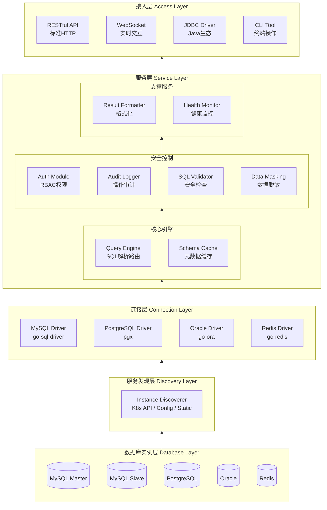
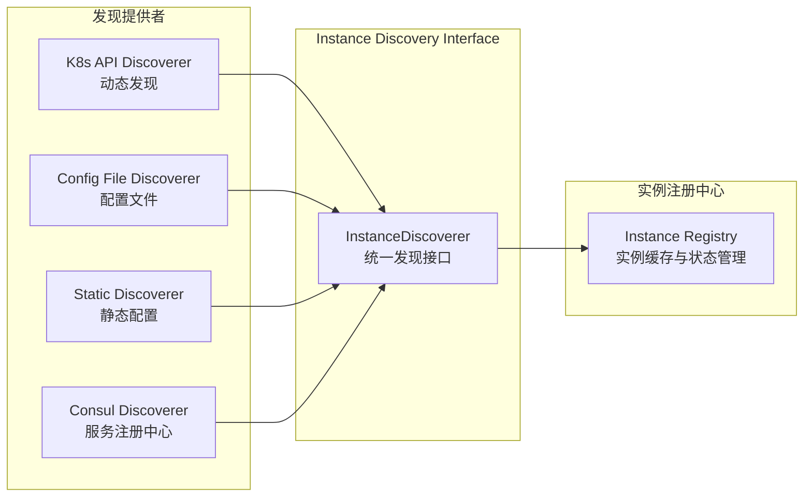
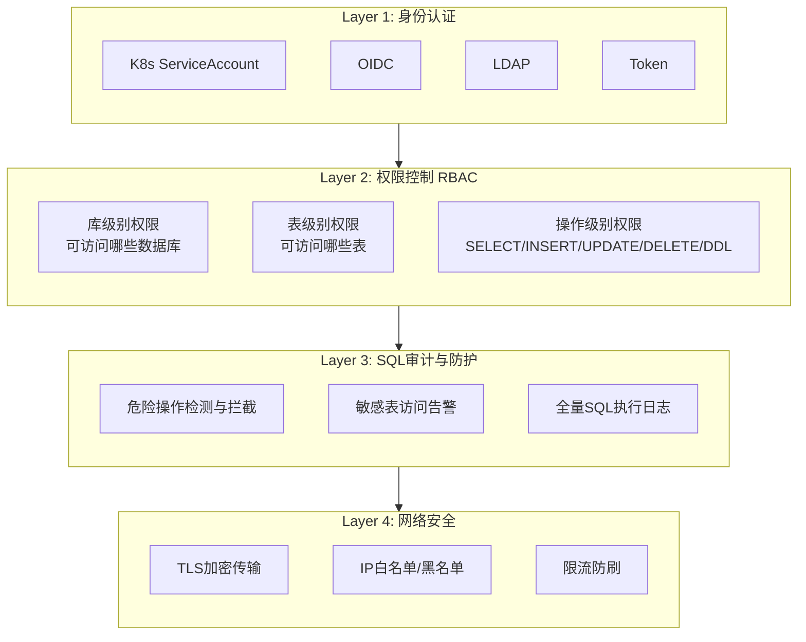
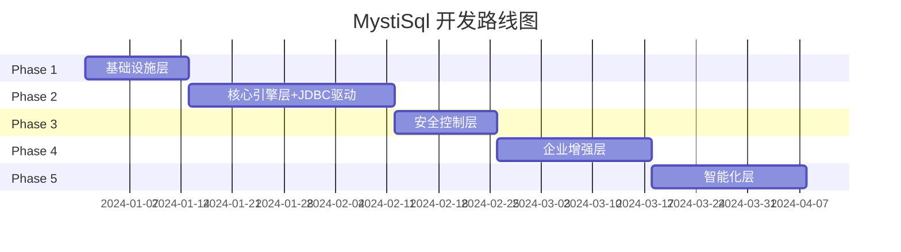
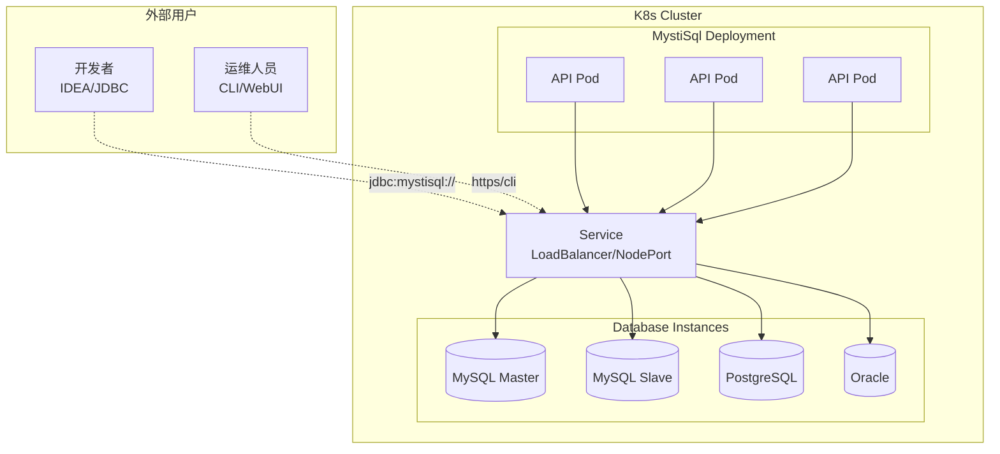

# MystiSql

## 问题
- 在一个k8s集群中，有多个数据库实例，其中包含mysql，postgresql，oracle等数据库，但是实例是无法通过外部进行访问，只能在k8s集群内部进行访问。
- 开发场景下，开发人员无法在自己的主机上，直接访问k8s集群中的数据库实例，即使在k8s集群中，也需要额外的引入不同数据库的cli客户端，在数据库pod中执行才能访问
- 运维场景下，运维人员无法在自己的主机上，直接访问k8s集群中的数据库实例，集群中由于安全问题，无法引入不同数据库的cli客户端，也导致无法在数据库pod中执行命令

## MystiSql 定位
- MystiSql 是一个数据库工具，为了方便开发人员和运维人员对一个k8s集群中的所有数据库进行操作。
- MystiSql 提供两种模式，分别是cli和webui，默认为cli模式
- MystiSql 的webui，使用restful的形式提供数据库查询和操作的接口，同时也提供一个websocket接口，方便使用者操作数据库，同时也提供一个webui界面，方便使用者进行操作。
- MystiSql 的cli模式，提供一个命令行界面，使用者在k8s集群中进行数据库查询和操作，cli模式也可以通过 MystiSqlti提供的restful接口进行操作。
- MystiSql 还需要提供一个jdbc驱动，方便开发人员在自己的主机上，直接访问k8s集群中的数据库实例。

## 核心价值

| 痛点场景 | 传统方案的局限 | MystiSql的突破 |
|---------|--------------|---------------|
| 开发调试 | 需要port-forward或VPN，配置复杂 | 统一入口，一次配置，随处访问 |
| 运维巡检 | 需要在Pod内安装各数据库CLI | WebUI/CLI双模式，零依赖访问 |
| 安全合规 | 直接暴露数据库端口有风险 | 集中管控，审计日志，权限控制 |
| 多数据库 | 每种数据库需要不同的客户端工具 | 统一接口，屏蔽差异 |

## 架构设计

### 整体架构

> 架构层次从下往上：数据库实例 → 服务发现 → 连接层 → 服务层 → 接入层



### 模块详解

> 模块从底层到上层依次介绍，体现依赖关系

#### 1. 数据库实例层 (Database Layer)

最底层，实际的数据库实例：
- MySQL（主库/从库）
- PostgreSQL
- Oracle
- Redis

#### 2. 服务发现层 (Discovery Layer)

负责发现和管理数据库实例信息：

**功能列表（从低级到高级）**

| 功能 | 级别 | 说明 |
|-----|------|------|
| 实例注册 | 基础 | 数据库实例信息录入 |
| 实例发现 | 基础 | 支持K8s API / 配置文件 / 静态配置 / 服务注册中心 |
| 状态监控 | 中级 | 实例健康状态检查 |
| 动态感知 | 高级 | 实例增删改的实时通知 |

**发现接口设计**



**发现模式详解**

| 模式 | 说明 | 适用场景 |
|-----|------|---------|
| **K8s API动态发现** | 通过client-go监听Service/Pod变化，自动发现带特定Label的数据库实例 | K8s原生环境，实例动态变化 |
| **配置文件发现** | 从ConfigMap/配置文件读取数据库实例列表 | 实例相对固定，需要精细控制 |
| **静态配置发现** | 启动参数或环境变量指定实例 | 单实例或少量实例，快速部署 |
| **服务注册中心发现** | 从Consul/Nacos等注册中心获取实例 | 多集群、混合云环境 |

**接口定义（Go伪代码）**

```go
type InstanceDiscoverer interface {
    Name() string
    Discover(ctx context.Context) ([]*DatabaseInstance, error)
    Watch(ctx context.Context) (<-chan DiscoveryEvent, error)
    Stop() error
}

type DatabaseInstance struct {
    Name        string
    Type        DatabaseType
    Host        string
    Port        int
    Labels      map[string]string
    Annotations map[string]string
    Status      InstanceStatus
}

type DiscoveryEvent struct {
    Type     EventType
    Instance *DatabaseInstance
}
```

**配置示例**

```yaml
discovery:
  k8s:
    enabled: true
    namespaces: [default, production, staging]
    selectors:
      - labelSelector: "app=mysql,environment=production"
        type: mysql
      - labelSelector: "app=postgresql"
        type: postgresql
    portMapping:
      mysql: 3306
      postgresql: 5432
      oracle: 1521
      
  config:
    enabled: true
    sources:
      - configMap:
          name: mystisql-instances
          namespace: mystisql
      - file:
          path: /etc/mystisql/instances.yaml
          
  static:
    enabled: false
    instances:
      - name: local-mysql
        type: mysql
        host: localhost
        port: 3306
```

#### 3. 连接层 (Connection Layer)

负责与数据库建立和维护连接：

**功能列表（从低级到高级）**

| 功能 | 级别 | 说明 |
|-----|------|------|
| 驱动适配 | 基础 | MySQL/PostgreSQL/Oracle/Redis驱动封装 |
| 连接建立 | 基础 | 创建数据库连接 |
| 连接池管理 | 中级 | 连接复用，避免频繁建立连接 |
| 健康检查 | 中级 | 连接可用性检测，自动重连 |
| 读写分离 | 高级 | 自动识别主从，路由读写请求 |
| 主从切换感知 | 高级 | 感知主从切换，自动更新路由 |

**多数据库驱动支持**

| 数据库 | 驱动 | 说明 |
|-------|------|------|
| MySQL | go-sql-driver/mysql | 官方推荐 |
| PostgreSQL | pgx | 高性能驱动 |
| Oracle | go-ora | 纯Go实现 |
| Redis | go-redis | 官方推荐 |

#### 4. 服务层 (Service Layer)

核心业务逻辑处理，按功能分组：

##### 4.1 核心引擎（基础功能）

**Query Engine (查询引擎)**

| 功能 | 级别 | 说明 |
|-----|------|------|
| SQL解析 | 基础 | 解析SQL语句结构 |
| SQL路由 | 基础 | 根据实例名路由到对应数据库 |
| 查询超时控制 | 中级 | 防止长时间运行的查询 |
| 结果集大小限制 | 中级 | 防止返回过多数据 |
| 智能读写分离 | 高级 | 自动识别读写请求，路由到主库/从库 |

**Schema Cache (元数据缓存)**

| 功能 | 级别 | 说明 |
|-----|------|------|
| 表结构缓存 | 基础 | 缓存表结构信息 |
| 索引信息缓存 | 中级 | 缓存索引信息，辅助优化 |
| 缓存失效策略 | 高级 | 表结构变更时自动刷新缓存 |

##### 4.2 安全控制（中级功能）

**Auth Module (认证授权)**

| 功能 | 级别 | 说明 |
|-----|------|------|
| Token认证 | 基础 | 简单的Token验证 |
| K8s ServiceAccount集成 | 中级 | 集成K8s原生认证 |
| OIDC/LDAP集成 | 中级 | 企业级认证集成 |
| RBAC权限模型 | 高级 | 库级别、表级别、操作级别权限控制 |

**Audit Logger (审计日志)**

| 功能 | 级别 | 说明 |
|-----|------|------|
| SQL执行记录 | 基础 | 记录执行的SQL语句 |
| 操作者信息 | 基础 | 记录谁执行了操作 |
| 敏感操作告警 | 中级 | DROP/TRUNCATE等危险操作告警 |
| 全量审计日志 | 高级 | 完整的操作审计链路 |

**SQL Validator (SQL安全检查)**

| 功能 | 级别 | 说明 |
|-----|------|------|
| 危险操作检测 | 基础 | 检测DROP、TRUNCATE等危险操作 |
| SQL白名单/黑名单 | 中级 | 配置允许/禁止的SQL模式 |
| 注入攻击防护 | 高级 | 检测并拦截SQL注入攻击 |

**Data Masking (数据脱敏)**

| 功能 | 级别 | 说明 |
|-----|------|------|
| 敏感字段识别 | 基础 | 识别手机号、身份证等敏感字段 |
| 规则脱敏 | 中级 | 按规则进行数据脱敏 |
| 基于角色的脱敏策略 | 高级 | 不同角色看到不同程度的脱敏数据 |

##### 4.3 支撑服务（高级功能）

**Result Formatter (结果格式化)**

| 功能 | 级别 | 说明 |
|-----|------|------|
| 基础格式化 | 基础 | 表格、JSON、CSV格式输出 |
| 分页处理 | 中级 | 大结果集分页返回 |
| 导出功能 | 高级 | 导出为Excel、SQL等格式 |

**Health Monitor (健康监控)**

| 功能 | 级别 | 说明 |
|-----|------|------|
| 连接数监控 | 基础 | 监控数据库连接数 |
| 慢查询捕获 | 中级 | 捕获执行时间超过阈值的SQL |
| 异常告警 | 高级 | 连接池耗尽、磁盘空间不足等告警 |
| 优化建议 | 高级 | 基于慢查询提供索引优化建议 |

#### 5. 接入层 (Access Layer)

最上层，面向用户的访问入口：

**功能列表（从低级到高级）**

| 功能 | 级别 | 说明 |
|-----|------|------|
| RESTful API | 基础 | 标准HTTP接口，OpenAPI文档 |
| CLI Tool | 基础 | 终端命令行工具，支持脚本化 |
| WebSocket | 中级 | 实时交互，长连接支持 |
| JDBC Driver | 高级 | Java生态无缝集成，IDEA直连 |
| WebUI | 高级 | 可视化操作界面 |

**各接入方式详解**

| 接入方式 | 协议 | 适用场景 | 特点 |
|---------|------|---------|------|
| RESTful API | HTTP/HTTPS | 系统集成、脚本调用 | 标准化、易集成 |
| CLI Tool | 命令行 | 运维操作、自动化脚本 | 轻量、可编程 |
| WebSocket | WS/WSS | WebUI实时交互 | 低延迟、双向通信 |
| JDBC Driver | JDBC | Java应用、IDEA连接 | 透明代理、无感知 |
| WebUI | HTTP/WS | 可视化操作 | 友好界面、功能丰富 |

**JDBC连接示例**

```java
String url = "jdbc:mystisql://gateway-host:port/database-instance";
Connection conn = DriverManager.getConnection(url, "user", "password");
```

## 安全架构



## 技术栈

| 模块 | 技术选型 | 说明 |
|-----|---------|------|
| Web框架 | Gin / Fiber | 高性能HTTP框架 |
| 数据库驱动 | go-sql-driver/mysql, pgx, go-ora | 官方/社区维护 |
| K8s集成 | client-go | 官方SDK |
| WebSocket | gorilla/websocket | 成熟稳定 |
| CLI框架 | cobra + viper | 命令行标准组合 |
| 权限控制 | casbin | 强大的访问控制库 |
| 日志 | zap | 结构化日志 |
| 缓存 | go-cache / ristretto | 元数据缓存 |

## 产品特性

### 1. 智能SQL路由
- 自动识别读写请求，路由到主库/从库
- 支持分库分表场景的透明访问

### 2. 查询历史与收藏
- 保存常用SQL查询
- 支持分享SQL片段给团队成员

### 3. 数据脱敏预览
- 敏感字段自动脱敏显示
- 基于角色的脱敏策略

### 4. 慢查询分析
- 自动捕获执行时间超过阈值的SQL
- 提供优化建议

### 5. 数据库健康看板
- 实时展示连接数、QPS、慢查询Top10
- 异常告警

## 开发路线

> 按照从底层到上层、从基础功能到高级功能的顺序规划，JDBC驱动作为核心接入能力优先实现

### Phase 1: 基础设施层 (Infrastructure) ✅ 已完成

**目标**：建立最底层的基础能力，实现数据库实例发现和连接

#### 1.1 服务发现层 - 基础功能
- [x] 实例注册接口（手动添加数据库实例）
- [x] 静态配置发现（从配置文件读取实例列表）
- [x] 实例信息存储（内存/文件）

#### 1.2 连接层 - 基础功能
- [x] MySQL驱动集成（go-sql-driver/mysql）
- [x] 连接建立（基础连接功能）
- [x] 连接配置管理（host、port、username、password）

#### 1.3 接入层 - 基础功能
- [x] RESTful API框架搭建（Gin）
- [x] 健康检查接口
- [x] CLI基础框架（cobra）

**交付物**：能够通过配置文件添加MySQL实例，通过API/CLI连接并执行简单SQL

---

### Phase 2: 核心引擎层 + JDBC驱动 (Core Engine & JDBC) ✅ 已完成

**目标**：实现SQL查询的核心处理能力，**同时发布JDBC驱动**，让用户可以在DataGrip、DBeaver等工具中使用

#### 2.1 服务发现层 - 中级功能
- [x] K8s API动态发现（client-go）
- [x] ConfigMap配置源支持
- [x] 实例状态监控（健康检查）

#### 2.2 连接层 - 中级功能
- [x] 连接池管理（连接复用）
- [x] 连接健康检查
- [x] 自动重连机制

#### 2.3 服务层 - 核心引擎
- [x] SQL解析（基础SQL语法解析）
- [x] SQL路由（根据实例名路由）
- [x] 查询超时控制
- [x] 结果集大小限制
- [x] 表结构缓存（Schema Cache）

#### 2.4 接入层 - 基础功能完善
- [x] SQL执行接口（POST /api/v1/query）
- [x] 实例列表接口（GET /api/v1/instances）
- [x] CLI查询命令（mystisql query）

#### 2.5 JDBC驱动 - 核心功能 ⭐P0
- [x] JDBC Driver基础框架（实现Driver接口）
- [x] Connection连接实现（连接MystiSql Gateway）
- [x] Statement/PreparedStatement实现（SQL执行）
- [x] ResultSet结果集实现（结果返回）
- [x] DatabaseMetaData实现（元数据查询，支持IDE工具识别）
- [x] 连接URL格式：`jdbc:mystisql://gateway-host:port/database-instance`

**交付物**：
- 完整的SQL查询能力，支持K8s动态发现，连接池管理
- **JDBC驱动发布**，可在DataGrip、DBeaver、SQuirreL等工具中使用

---

### Phase 3: 安全控制层 (Security) ✅ 已完成

**目标**：实现企业级安全控制能力

#### 3.1 服务层 - 安全控制
- [x] Token认证（JWT HS256签名）
- [x] SQL执行记录（审计日志基础）
- [x] 危险操作检测（DROP、TRUNCATE拦截）
- [x] SQL白名单/黑名单（正则匹配）

#### 3.2 接入层 - 中级功能
- [x] WebSocket支持（实时交互）
- [x] CLI认证集成（auth子命令）
- [x] API认证中间件（Gin中间件）

#### 3.3 连接层 - 扩展
- [x] PostgreSQL驱动支持（pgx）
- [x] 多数据库类型路由（根据type字段）

#### 3.4 JDBC驱动 - 增强
- [x] JDBC连接池支持（HikariCP兼容）
- [x] 事务支持（begin/commit/rollback API）
- [x] 批量操作支持（POST /api/v1/batch）
- [x] 认证集成（Token传递）

**交付物**：具备安全控制能力的数据库访问网关，JDBC驱动功能完善

---

### Phase 4: 企业增强层 (Enterprise)

**目标**：企业级功能完善，支持生产环境部署

#### 4.1 服务发现层 - 高级功能
- [ ] 实例动态感知（Watch机制）
- [ ] 服务注册中心发现（Consul/Nacos）
- [ ] 多集群实例管理

#### 4.2 连接层 - 高级功能
- [ ] 读写分离（主从路由）
- [ ] 主从切换感知

#### 4.3 服务层 - 安全增强
- [ ] K8s ServiceAccount集成
- [ ] OIDC/LDAP集成
- [ ] RBAC权限模型（库级别、表级别、操作级别）
- [ ] 全量审计日志
- [ ] SQL注入防护
- [ ] 敏感字段识别
- [ ] 规则脱敏

#### 4.4 接入层 - 高级功能
- [ ] WebUI基础界面
- [ ] SQL编辑器（语法高亮）
- [ ] 结果集展示
- [ ] Oracle驱动支持（go-ora）

**交付物**：企业级数据库访问平台，支持多数据库、完整安全控制

---

### Phase 5: 智能化层 (Intelligence)

**目标**：智能化运维和高级用户体验

#### 5.1 服务层 - 支撑服务
- [ ] 结果格式化（JSON/CSV/Table）
- [ ] 分页处理
- [ ] 导出功能（Excel/SQL）
- [ ] 连接数监控
- [ ] 慢查询捕获
- [ ] 异常告警
- [ ] 优化建议（索引推荐）

#### 5.2 服务层 - 高级安全
- [ ] 基于角色的脱敏策略
- [ ] 完整审计链路

#### 5.3 接入层 - 高级功能
- [ ] WebUI完整功能
- [ ] 查询历史与收藏
- [ ] 数据库健康看板
- [ ] Redis驱动支持（go-redis）

**交付物**：智能化数据库运维平台

---

### 开发路线图



### 功能优先级矩阵

| 优先级 | 功能 | 阶段 | 价值 |
|-------|------|------|------|
| **P0** | MySQL连接、静态配置发现、RESTful API | Phase 1 | MVP核心 |
| **P0** | SQL解析路由、连接池 | Phase 2 | 核心能力 |
| **P0** | **JDBC驱动（核心功能）** | Phase 2 | **IDE工具集成** |
| P1 | K8s动态发现、Token认证、审计日志 | Phase 2-3 | 生产可用 |
| P1 | PostgreSQL支持、WebSocket | Phase 3 | 多数据库 |
| P1 | JDBC驱动增强（连接池、事务） | Phase 3 | JDBC完善 |
| P2 | RBAC权限、读写分离、WebUI | Phase 4 | 企业级 |
| P2 | OIDC/LDAP、数据脱敏、Oracle支持 | Phase 4 | 安全合规 |
| P3 | 慢查询分析、健康看板 | Phase 5 | 智能化 |
| P3 | 优化建议、Redis支持 | Phase 5 | 高级特性 |

### 里程碑

| 里程碑 | 阶段完成 | 核心能力 | 状态 |
|-------|---------|---------|------|
| **M1** | Phase 1 | 可连接MySQL执行SQL | ✅ 已完成 |
| **M2** | Phase 2 | **JDBC驱动发布**、K8s动态发现、连接池、完整查询能力 | ✅ 已完成 |
| **M3** | Phase 3 | 安全认证、审计日志、PostgreSQL支持、WebSocket、JDBC增强 | ✅ 已完成 |
| **M4** | Phase 4 | 企业级权限、读写分离、WebUI上线 | ⏳ 规划中 |
| **M5** | Phase 5 | 智能化运维平台 | 📋 规划中 |

### 功能规格 (OpenSpec)

项目使用 OpenSpec 管理功能规格，所有规格定义在 `openspec/specs/` 目录：

| 类别 | 规格 | 描述 |
|------|------|------|
| **数据库连接** | mysql-connection | MySQL 连接和查询 |
| | postgresql-driver | PostgreSQL 驱动支持 |
| **REST API** | rest-api | RESTful API 端点 |
| | websocket-support | WebSocket 实时交互 |
| **安全认证** | token-auth | JWT Token 认证 |
| | api-auth-middleware | API 认证中间件 |
| | cli-auth | CLI 认证集成 |
| **审计验证** | audit-logging | 审计日志记录 |
| | sql-validator | SQL 安全检查 |
| | sql-whitelist-blacklist | SQL 白名单/黑名单 |
| **JDBC** | java-jdbc-driver | Java JDBC 驱动 |
| | jdbc-transaction | JDBC 事务管理 |
| | jdbc-batch-operations | JDBC 批量操作 |
| | jdbc-prepared-statement | JDBC 预编译语句 |
| | jdbc-metadata | JDBC 元数据 |
| | jdbc-api-client | JDBC API 客户端 |
| **CLI** | cli-interface | CLI 接口 |
| | cli-tui | TUI 界面 |
| | mysql-cli-style-repl | MySQL 风格 REPL |
| | repl-line-editing | REPL 行编辑 |
| | multiline-sql-input | 多行 SQL 输入 |
| | streaming-output | 流式输出 |
| | sql-execution-tui | TUI SQL 执行 |
| | instance-switching-tui | TUI 实例切换 |
| **基础设施** | config-management | 配置管理 |
| | instance-discovery-static | 静态实例发现 |
| | directory-structure | 目录结构 |

### Phase 3: 安全控制层 - 实现完成 ✅

**完成度**: 112/112 任务 (100%) - **全部功能已完成**

#### 已实现的功能模块

**1. Token 认证机制** ✅
- JWT Token 生成和验证 (HS256签名)
- Token 黑名单管理
- REST API: POST/DELETE/GET /api/v1/auth/token
- CLI auth 子命令: token, revoke, info

**2. 审计日志系统** ✅
- 异步日志写入 (buffered channel)
- 日志轮转机制 (按天轮转，保留30天)
- 结构化日志格式 (JSON Lines)
- REST API: GET /api/v1/audit/logs

**3. SQL 安全检查** ✅
- 危险操作检测 (DROP、TRUNCATE、无WHERE的DELETE/UPDATE)
- SQL 白名单/黑名单 (正则匹配)
- 优先级逻辑 (黑名单优先)
- 配置热更新

**4. API 认证中间件** ✅
- Gin 认证中间件
- 白名单路径配置 (/health 无需认证)
- 用户信息注入到 gin.Context
- 认证失败日志记录

**5. PostgreSQL 驱动支持** ✅
- PostgreSQL Connection 实现 (pgx驱动)
- ConnectionPool 管理
- 多数据库类型路由 (根据 instance.type 选择驱动)
- PostgreSQL 特有配置 (sslmode, connectTimeout)

**6. WebSocket 实时交互** ✅
- WebSocket 握手处理器 (Token认证)
- 消息格式定义 (JSON)
- 连接管理 (最大连接数、空闲超时、并发查询限制)
- 心跳机制 (ping/pong)

**7. JDBC 事务管理** ✅
- 事务上下文管理 (connectionId绑定)
- REST API: begin/commit/rollback
- 事务超时自动回滚
- 事务隔离级别配置

**8. JDBC 批量操作** ✅
- 批量 SQL 执行器 (INSERT/UPDATE/DELETE)
- 混合批处理支持
- 批量操作大小限制 (默认1000)
- REST API: POST /api/v1/batch

#### 配置示例

```yaml
# config.yaml
server:
  host: "0.0.0.0"
  port: 8080
  mode: "release"

# Token 认证配置
auth:
  enabled: true
  token:
    secret: "change-this-secret-in-production"
    expire: "24h"
  whitelist:
    - "/health"
    - "/api/v1/auth/login"

# 审计日志配置
audit:
  enabled: true
  logFile: "/var/log/mystisql/audit.log"
  retentionDays: 30

# SQL 验证器配置
validator:
  enabled: true
  dangerousOperations:
    - "DROP"
    - "TRUNCATE"
    - "DELETE_WITHOUT_WHERE"
    - "UPDATE_WITHOUT_WHERE"
  whitelist: []
  blacklist: []

# WebSocket 配置
websocket:
  enabled: true
  maxConnections: 1000
  idleTimeout: "10m"
  maxConcurrentQueries: 5
```

#### 新增 API 端点

**认证相关**:
- `POST /api/v1/auth/token` - 生成 Token
- `DELETE /api/v1/auth/token` - 撤销 Token
- `GET /api/v1/auth/tokens` - 查询 Token 列表

**审计日志**:
- `GET /api/v1/audit/logs` - 查询审计日志

**SQL 验证器**:
- `PUT /api/v1/validator/whitelist` - 更新白名单
- `PUT /api/v1/validator/blacklist` - 更新黑名单

**WebSocket**:
- `ws://host:port/ws` - WebSocket 端点

#### 代码统计

| 类别 | 数量 |
|------|------|
| 功能规格 (OpenSpec) | 28 个 |
| 源代码文件 | 60+ 个 |
| 测试文件 | 25+ 个 |
| 代码总行数 | ~15,000 行 |

#### 生产就绪度

| 功能模块 | 完成度 | 生产就绪 | 测试覆盖 |
|---------|--------|---------|---------|
| Token 认证 | 100% | ✅ 是 | ✅ 完整 |
| 审计日志 | 100% | ✅ 是 | ✅ 完整 |
| SQL 验证 | 100% | ✅ 是 | ✅ 完整 |
| 认证中间件 | 100% | ✅ 是 | ✅ 完整 |
| PostgreSQL | 100% | ✅ 是 | ✅ 完整 |
| WebSocket | 100% | ✅ 是 | ✅ 完整 |
| JDBC 事务 | 100% | ✅ 是 | ✅ 完整 |
| JDBC 批量操作 | 100% | ✅ 是 | ✅ 完整 |
| CLI 认证 | 100% | ✅ 是 | ✅ 完整 |

**总体生产就绪度**: **100%** - Phase 3 全部功能已就绪

### JDBC驱动使用场景

JDBC驱动发布后，用户可以在以下工具中直接使用MystiSql：

| 工具 | 使用场景 | 优势 |
|-----|---------|------|
| **DataGrip** | 开发调试 | 无需配置port-forward，直接连接K8s数据库 |
| **DBeaver** | 数据管理 | 统一管理多个K8s数据库实例 |
| **SQuirreL SQL** | 通用SQL客户端 | 跨平台支持 |
| **JMeter** | 性能测试 | 直接对K8s数据库进行压测 |
| **自定义Java应用** | 业务集成 | 应用层透明访问K8s数据库 |

**连接示例**：
```java
// DataGrip / DBeaver 配置
String url = "jdbc:mystisql://mystisql-gateway.example.com:3306/production-mysql";
String user = "your-username";
String password = "your-token";

Connection conn = DriverManager.getConnection(url, user, password);
Statement stmt = conn.createStatement();
ResultSet rs = stmt.executeQuery("SELECT * FROM users LIMIT 10");
```

## 部署架构



## E2E 测试

MystiSql 提供了完整的端到端（E2E）测试环境，使用 Podman 容器化部署 MySQL 8 和 PostgreSQL 14 数据库实例。

### 前置条件

- **Podman**: 需要 Podman 5.0+ 版本
- **Go**: 需要 Go 1.21+ 版本
- **磁盘空间**: 至少 2GB 可用空间（用于数据库镜像）

### 快速开始

#### 1. 设置测试环境

```bash
# 启动 MySQL 8 和 PostgreSQL 14 容器
make e2e-setup

# 或使用脚本
./scripts/e2e/setup-test-env.sh
```

输出示例：
```
=== MystiSql E2E Test Environment Setup ===
MySQL Port: 13306
PostgreSQL Port: 15432

Step 3: Starting MySQL 8 container...
Step 4: Starting PostgreSQL 14 container...
Step 5: Waiting for databases to be ready...
MySQL is ready!
PostgreSQL is ready!
Step 6: Initializing test data...

=== Test Environment Ready ===

MySQL Connection:
  Host: localhost
  Port: 13306
  User: root
  Password: test123456
  Database: mystisql_test

PostgreSQL Connection:
  Host: localhost
  Port: 15432
  User: postgres
  Password: test123456
  Database: mystisql_test
```

#### 2. 运行 E2E 测试

```bash
# 运行所有 E2E 测试
make e2e-test

# 或直接使用 go test
go test -v -tags=e2e ./test/e2e/...

# 运行特定测试
go test -v -tags=e2e -run TestMySQLBasic ./test/e2e/...
```

#### 3. 清理测试环境

```bash
# 停止并删除测试容器
make e2e-teardown

# 或使用脚本
./scripts/e2e/teardown-test-env.sh
```

### 测试环境管理

#### 检查环境状态

```bash
make e2e-check

# 或
./scripts/e2e/check-env.sh
```

输出示例：
```
=== MystiSql E2E Test Environment Check ===

1. Checking Podman...
   ✓ Podman installed: podman version 5.7.1

2. Checking container images...
   ✓ MySQL 8 image available
   ✓ PostgreSQL 14 image available

3. Checking container status...
   ✓ MySQL container is running
   ✓ PostgreSQL container is running

5. Checking ports...
   ✓ MySQL port 13306 is listening
   ✓ PostgreSQL port 15432 is listening

=== Summary ===
✓ All checks passed! Environment is ready for e2e testing.
```

#### 重置测试数据

```bash
# 重置所有测试数据库
make e2e-reset

# 或重置特定数据库
./scripts/e2e/reset-db.sh mysql      # 仅重置 MySQL
./scripts/e2e/reset-db.sh postgres   # 仅重置 PostgreSQL
```

### 测试内容

E2E 测试覆盖以下核心功能：

#### 1. 基础连接测试 (`test/e2e/basic_test.go`)
- MySQL 连接建立和健康检查
- PostgreSQL 连接建立和健康检查
- 基础查询执行（SELECT）

#### 2. MySQL 连接池测试
- 连接池管理（并发连接、连接复用）
- 查询执行（SELECT, INSERT, UPDATE, DELETE）
- 结果处理（NULL 值、各种数据类型）
- 超时处理
- 错误处理（无效 SQL、约束冲突）

#### 3. PostgreSQL 驱动测试
- 连接和查询执行
- PostgreSQL 特有功能（RETURNING, CTE, JSONB, 数组类型）
- SSL 模式配置
- 错误处理（唯一约束、外键约束）

#### 4. 事务管理测试
- 事务提交和回滚
- 事务隔离性（READ COMMITTED）
- 并发事务
- 事务超时

#### 5. 批量操作测试
- 批量插入（100 条记录）
- 批量更新和删除
- 混合批处理
- 性能对比测试

### 测试配置

E2E 测试配置文件位于 `config/e2e-test.yaml`：

```yaml
# MySQL 测试实例
instances:
  - name: "test-mysql"
    type: "mysql"
    host: "127.0.0.1"
    port: 13306
    username: "root"
    password: "test123456"
    database: "mystisql_test"

  - name: "test-postgres"
    type: "postgresql"
    host: "127.0.0.1"
    port: 15432
    username: "postgres"
    password: "test123456"
    database: "mystisql_test"
```

可以通过环境变量覆盖配置：

```bash
export MYSQL_HOST=127.0.0.1
export MYSQL_PORT=13306
export POSTGRES_HOST=127.0.0.1
export POSTGRES_PORT=15432
```

### 测试数据

测试数据初始化脚本：

- `test/e2e/init-mysql.sql` - MySQL 测试数据（10 用户、12 产品、10 订单）
- `test/e2e/init-postgres.sql` - PostgreSQL 测试数据（含 JSONB、数组类型）

### 自定义端口

如果默认端口被占用，可以通过环境变量修改：

```bash
export MYSQL_PORT=23306
export POSTGRES_PORT=25432

./scripts/e2e/setup-test-env.sh
```

### CI/CD 集成

在 CI/CD 流程中集成 E2E 测试：

```yaml
# GitHub Actions 示例
name: E2E Tests

on: [push, pull_request]

jobs:
  e2e-test:
    runs-on: ubuntu-latest
    steps:
      - uses: actions/checkout@v3
      
      - name: Setup Go
        uses: actions/setup-go@v4
        with:
          go-version: '1.21'
      
      - name: Install Podman
        run: |
          sudo apt-get update
          sudo apt-get install -y podman
      
      - name: Setup E2E Environment
        run: make e2e-setup
      
      - name: Run E2E Tests
        run: make e2e-test
      
      - name: Cleanup
        if: always()
        run: make e2e-teardown
```

### 跳过 E2E 测试

在短模式下运行测试会跳过 E2E 测试：

```bash
# 跳过 E2E 测试
go test -short ./...

# 或者不添加 -tags=e2e
go test ./test/e2e/...  # 会被跳过
```

### 故障排查

#### 容器启动失败

```bash
# 检查 Podman 状态
podman info

# 查看容器日志
podman logs mystisql-test-mysql
podman logs mystisql-test-postgres

# 检查端口占用
netstat -tuln | grep 13306
netstat -tuln | grep 15432
```

#### 镜像拉取失败

如果遇到镜像拉取问题，配置 Podman 镜像加速器：

```bash
# 编辑 ~/.config/containers/registries.conf
cat > ~/.config/containers/registries.conf <<EOF
unqualified-search-registries = ["docker.io"]

[[registry]]
prefix = "docker.io"
location = "docker.io"

[[registry.mirror]]
location = "docker.1panel.live"
EOF
```

#### 数据库连接失败

```bash
# 检查容器状态
podman ps

# 测试数据库连接
podman exec mystisql-test-mysql mysql -uroot -ptest123456 -e "SELECT 1"
podman exec mystisql-test-postgres psql -U postgres -c "SELECT 1"
```

### Makefile 命令

完整的 E2E 测试相关命令：

```bash
make e2e-check          # 检查环境状态
make e2e-setup          # 启动测试环境
make e2e-test           # 运行 E2E 测试
make e2e-test-coverage  # 运行测试并生成覆盖率报告
make e2e-teardown       # 清理测试环境
make e2e-reset          # 重置测试数据库
make e2e-reset-mysql    # 仅重置 MySQL
make e2e-reset-postgres # 仅重置 PostgreSQL
```

### 性能基准测试

运行性能基准测试：

```bash
# 运行批量插入性能测试
go test -v -tags=e2e -bench=BenchmarkBatchInsert -benchmem ./test/e2e/...
```

## 快速开始

### 安装

#### 从源码编译

```bash
# 克隆仓库
git clone https://github.com/your-org/MystiSql.git
cd MystiSql

# 编译
go build -o bin/mystisql ./cmd/mystisql

# 编译 Linux 版本
GOOS=linux GOARCH=amd64 go build -o bin/mystisql-linux-amd64 ./cmd/mystisql
```

### 配置

1. 创建配置文件 `config.yaml`：

```yaml
# 服务器配置
server:
  host: 0.0.0.0
  port: 8080
  mode: release  # debug 或 release

# 服务发现配置
discovery:
  type: static  # static, k8s, consul

# 数据库实例列表
instances:
  - name: local-mysql
    type: mysql
    host: localhost
    port: 3306
    username: root
    password: root
    database: test
    labels:
      environment: development
```

详细配置说明请参考 [配置说明](#配置说明) 章节。

### CLI 使用示例

#### REPL 交互模式（默认）

MystiSql 默认启动 MySQL 风格的 REPL (Read-Eval-Print-Loop) 交互界面，提供与 MySQL 命令行客户端高度相似的体验：

```bash
# 直接运行，启动 REPL 交互界面
./bin/mystisql

# 指定配置文件启动 REPL
./bin/mystisql --config config.yaml
```

**REPL 界面示例**:

```
Welcome to the MystiSql monitor. Commands end with ; or \g.
Your MystiSql connection has 1 instance(s) configured.
Current instance: local-mysql

Type 'help' or '\h' for help. Type '\c' to clear current input statement.

mystisql@local-mysql> SELECT * FROM users LIMIT 2;
+----+-------+-------------------+
| id | name  | email             |
+----+-------+-------------------+
|  1 | Alice | alice@example.com |
|  2 | Bob   | bob@example.com   |
+----+-------+-------------------+
2 row(s) in set (0.005 sec)

mystisql@local-mysql> INSERT INTO users (name, email) VALUES ('Charlie', 'charlie@example.com');
Query OK, 1 row(s) affected (0.003 sec)
Last insert ID: 3

mystisql@local-mysql> _
```

**REPL 快捷键**:

| 快捷键 | 功能 |
|--------|------|
| Enter | 执行 SQL 或命令 |
| ↑/↓ | 浏览历史命令 |
| Ctrl+C | 中断当前输入/退出 |
| Ctrl+D | 删除字符 |
| Ctrl+A | 移动到行首 |
| Ctrl+E | 移动到行尾 |

**REPL 内置命令**:

| 命令 | 短格式 | 描述 |
|------|--------|------|
| exit, quit | \q | 退出 REPL |
| help | \h, ? | 显示帮助 |
| clear | \c | 清除当前输入 |
| status | \s | 显示状态 |
| print | \p | 打印当前输入 |
| edit | \e | 编辑当前输入 ($EDITOR) |
| use | | 切换实例 (USE <instance>) |
| prompt | \R | 自定义提示符 |
| source | \. | 执行脚本文件 |
| system | \! | 执行系统命令 |
| output | \o | 设置输出格式 (csv, json) |

**REPL 输出格式**:

- 表格格式（默认）: ASCII 表格，自动对齐
- 垂直格式 (`\G`): 每行一列显示
- CSV 格式 (`\o csv`)
- JSON 格式 (`\o json`)

**REPL 特性**:
- 多行 SQL 输入（以 `;` 或 `\g` 结尾）
- 续行提示符（`->`, `'>`, `">`, `` `> ``）
- 命令历史（存储在 `~/.mystisql/history`）
- 上下箭头浏览历史
- 历史去重和持久化

#### 直接执行 SQL（query 子命令）

如果不需要交互界面，可以使用 `query` 子命令直接执行 SQL：

```bash
# 执行 SELECT 查询
./bin/mystisql query --instance local-mysql "SELECT * FROM users LIMIT 5"

# JSON 格式输出
./bin/mystisql query --instance local-mysql "SELECT * FROM users LIMIT 5" --format json

# 执行 INSERT
./bin/mystisql query --instance local-mysql "INSERT INTO users (name, email) VALUES ('Alice', 'alice@example.com')"

# 执行 UPDATE
./bin/mystisql query --instance local-mysql "UPDATE users SET name='Bob' WHERE id=1"

# 执行 DELETE
./bin/mystisql query --instance local-mysql "DELETE FROM users WHERE id=1"
```

输出示例（SELECT 查询）：
```
id   name    email
1    Alice   alice@example.com
2    Bob     bob@example.com

2 行数据，执行时间: 5ms
```

输出示例（INSERT/UPDATE/DELETE）：
```
受影响行数: 1
最后插入ID: 123
执行时间: 3ms
```

#### 查看版本

```bash
./bin/mystisql version
# 输出: MystiSql 0.1.0
```

#### 列出数据库实例

```bash
# 使用默认配置文件路径
./bin/mystisql instances list

# 指定配置文件
./bin/mystisql --config config/config.yaml instances list

# JSON 格式输出
./bin/mystisql instances list --format json

# CSV 格式输出
./bin/mystisql instances list --format csv
```

输出示例（表格格式）：
```
NAME                      TYPE    HOST                                        PORT   DATABASE        STATUS
local-mysql               mysql   localhost                                   3306   test            unknown
production-mysql-master   mysql   mysql-master.production.svc.cluster.local   3306   production_db   unknown
```

#### 执行 SQL 查询

```bash
# 执行 SELECT 查询
./bin/mystisql query --instance local-mysql "SELECT * FROM users LIMIT 5"

# JSON 格式输出
./bin/mystisql query --instance local-mysql "SELECT * FROM users LIMIT 5" --format json

# 执行 INSERT
./bin/mystisql query --instance local-mysql "INSERT INTO users (name, email) VALUES ('Alice', 'alice@example.com')"

# 执行 UPDATE
./bin/mystisql query --instance local-mysql "UPDATE users SET name='Bob' WHERE id=1"

# 执行 DELETE
./bin/mystisql query --instance local-mysql "DELETE FROM users WHERE id=1"
```

输出示例（SELECT 查询）：
```
id   name    email
1    Alice   alice@example.com
2    Bob     bob@example.com

2 行数据，执行时间: 5ms
```

输出示例（INSERT/UPDATE/DELETE）：
```
受影响行数: 1
最后插入ID: 123
执行时间: 3ms
```

#### 查看实例详情

```bash
./bin/mystisql instances get local-mysql
```

输出示例：
```
实例名称: local-mysql
数据库类型: mysql
主机地址: localhost
端口号: 3306
数据库名: test
用户名: root
状态: unknown
创建时间: 2026-03-06 10:00:00
更新时间: 2026-03-06 10:00:00

标签:
  environment: development
```

### API 使用示例

MystiSql 提供 RESTful API 接口（Phase 1 实现了基础 API 框架）。

#### 健康检查

```bash
curl http://localhost:8080/health
```

响应示例：
```json
{
  "status": "healthy",
  "version": "0.1.0",
  "timestamp": "2026-03-06T10:00:00Z"
}
```

#### 列出实例

```bash
curl http://localhost:8080/api/v1/instances
```

响应示例：
```json
{
  "instances": [
    {
      "name": "local-mysql",
      "type": "mysql",
      "host": "localhost",
      "port": 3306,
      "database": "test",
      "status": "unknown",
      "labels": {
        "environment": "development"
      }
    }
  ]
}
```

#### 执行查询

```bash
curl -X POST http://localhost:8080/api/v1/query \
  -H "Content-Type: application/json" \
  -d '{
    "instance": "local-mysql",
    "query": "SELECT * FROM users LIMIT 5"
  }'
```

响应示例：
```json
{
  "columns": [
    {"name": "id", "type": "int"},
    {"name": "name", "type": "varchar"},
    {"name": "email", "type": "varchar"}
  ],
  "rows": [
    [1, "Alice", "alice@example.com"],
    [2, "Bob", "bob@example.com"]
  ],
  "rowCount": 2,
  "executionTime": 5000000
}
```

## 配置说明

### 配置文件结构

MystiSql 使用 YAML 格式的配置文件，支持以下配置项：

#### server - 服务器配置

```yaml
server:
  host: 0.0.0.0        # API 服务器监听地址（默认：0.0.0.0）
  port: 8080           # API 服务器监听端口（默认：8080）
  mode: release        # 运行模式：debug（调试）或 release（生产）
```

**字段说明：**

| 字段 | 类型 | 必填 | 默认值 | 说明 |
|-----|------|------|--------|------|
| host | string | 否 | 0.0.0.0 | API 服务器监听地址，0.0.0.0 表示监听所有网络接口 |
| port | int | 否 | 8080 | API 服务器监听端口，建议使用 1024 以上的端口 |
| mode | string | 否 | release | 运行模式，debug 会输出详细日志，release 为生产模式 |

#### discovery - 服务发现配置

```yaml
discovery:
  type: static         # 发现类型：static、k8s、consul
```

**字段说明：**

| 字段 | 类型 | 必填 | 默认值 | 说明 |
|-----|------|------|--------|------|
| type | string | 否 | static | 服务发现类型 |
|     |       |      |        | • static: 静态配置（从配置文件读取） |
|     |       |      |        | • k8s: Kubernetes API 动态发现（Phase 2） |
|     |       |      |        | • consul: Consul 服务发现（Phase 4） |

#### instances - 数据库实例列表

```yaml
instances:
  - name: local-mysql              # 实例名称（唯一标识）
    type: mysql                    # 数据库类型
    host: localhost                # 主机地址
    port: 3306                     # 端口号
    username: root                 # 用户名
    password: root                 # 密码
    database: test                 # 数据库名
    labels:                        # 标签（可选）
      environment: development
      team: backend
```

**字段说明：**

| 字段 | 类型 | 必填 | 默认值 | 说明 |
|-----|------|------|--------|------|
| name | string | 是 | - | 实例名称，必须唯一，用于查询时指定实例 |
| type | string | 是 | - | 数据库类型，支持：mysql、postgresql、oracle、redis |
| host | string | 是 | - | 数据库主机地址，可以是 IP 或域名 |
| port | int | 是 | - | 数据库端口号 |
| username | string | 否 | - | 数据库用户名 |
| password | string | 否 | - | 数据库密码，建议使用环境变量 |
| database | string | 否 | - | 默认连接的数据库名 |
| labels | map | 否 | - | 实例标签，K8s 风格的键值对 |

**支持的数据库类型：**

- `mysql`: MySQL 数据库（Phase 1 支持）
- `postgresql`: PostgreSQL 数据库（Phase 2 支持）
- `oracle`: Oracle 数据库（Phase 2 支持）
- `redis`: Redis 数据库（Phase 3 支持）

### 环境变量覆盖

可以使用环境变量覆盖配置文件中的值：

```bash
# 服务器配置
export MYSTISQL_SERVER_HOST=0.0.0.0
export MYSTISQL_SERVER_PORT=8080
export MYSTISQL_SERVER_MODE=release

# 服务发现配置
export MYSTISQL_DISCOVERY_TYPE=static

# 实例配置（数组索引从 0 开始）
export MYSTISQL_INSTANCES_0_NAME=local-mysql
export MYSTISQL_INSTANCES_0_HOST=localhost
export MYSTISQL_INSTANCES_0_PORT=3306
export MYSTISQL_INSTANCES_0_USERNAME=root
export MYSTISQL_INSTANCES_0_PASSWORD=secret
```

### 配置示例

#### 开发环境配置

```yaml
server:
  host: 0.0.0.0
  port: 8080
  mode: debug

discovery:
  type: static

instances:
  - name: dev-mysql
    type: mysql
    host: localhost
    port: 3306
    username: root
    password: root
    database: dev_db
    labels:
      environment: development
```

#### 生产环境配置

```yaml
server:
  host: 0.0.0.0
  port: 8080
  mode: release

discovery:
  type: static

instances:
  - name: production-mysql-master
    type: mysql
    host: mysql-master.production.svc.cluster.local
    port: 3306
    username: mystisql_user
    password: ${MYSQL_MASTER_PASSWORD}  # 从环境变量读取
    database: production_db
    labels:
      environment: production
      role: master
      
  - name: production-mysql-slave
    type: mysql
    host: mysql-slave.production.svc.cluster.local
    port: 3306
    username: mystisql_user
    password: ${MYSQL_SLAVE_PASSWORD}
    database: production_db
    labels:
      environment: production
      role: slave
```

### 配置文件位置

MystiSql 按以下顺序查找配置文件：

1. 命令行参数 `--config` 或 `-c` 指定的路径
2. 环境变量 `MYSTISQL_CONFIG` 指定的路径
3. 当前目录下的 `config.yaml`
4. `/etc/mystisql/config.yaml`

## API文档

### API 端点

Phase 1 实现了以下 API 端点：

#### 健康检查

**GET /health**

检查服务健康状态。

**请求示例：**
```bash
curl http://localhost:8080/health
```

**响应示例：**
```json
{
  "status": "healthy",
  "version": "0.1.0",
  "timestamp": "2026-03-06T10:00:00Z"
}
```

**字段说明：**

| 字段 | 类型 | 说明 |
|-----|------|------|
| status | string | 服务状态：healthy（健康）、unhealthy（不健康） |
| version | string | MystiSql 版本号 |
| timestamp | string | 响应时间戳（ISO 8601 格式） |

#### 列出实例

**GET /api/v1/instances**

获取所有已注册的数据库实例列表。

**请求示例：**
```bash
curl http://localhost:8080/api/v1/instances
```

**响应示例：**
```json
{
  "instances": [
    {
      "name": "local-mysql",
      "type": "mysql",
      "host": "localhost",
      "port": 3306,
      "database": "test",
      "username": "root",
      "status": "unknown",
      "labels": {
        "environment": "development"
      },
      "createdAt": "2026-03-06T10:00:00Z",
      "updatedAt": "2026-03-06T10:00:00Z"
    }
  ]
}
```

#### 执行查询

**POST /api/v1/query**

在指定数据库实例上执行 SQL 查询。

**请求示例：**
```bash
curl -X POST http://localhost:8080/api/v1/query \
  -H "Content-Type: application/json" \
  -d '{
    "instance": "local-mysql",
    "query": "SELECT * FROM users LIMIT 5",
    "timeout": 30
  }'
```

**请求体字段：**

| 字段 | 类型 | 必填 | 默认值 | 说明 |
|-----|------|------|--------|------|
| instance | string | 是 | - | 实例名称 |
| query | string | 是 | - | SQL 查询语句 |
| timeout | int | 否 | 30 | 超时时间（秒） |

**响应示例（SELECT 查询）：**
```json
{
  "columns": [
    {"name": "id", "type": "int"},
    {"name": "name", "type": "varchar"},
    {"name": "email", "type": "varchar"}
  ],
  "rows": [
    [1, "Alice", "alice@example.com"],
    [2, "Bob", "bob@example.com"]
  ],
  "rowCount": 2,
  "executionTime": 5000000
}
```

**响应示例（INSERT/UPDATE/DELETE）：**
```json
{
  "rowsAffected": 1,
  "lastInsertId": 123,
  "executionTime": 3000000
}
```

### 错误响应

当请求失败时，API 会返回错误信息：

**响应格式：**
```json
{
  "error": "错误描述",
  "code": "ERROR_CODE",
  "details": "详细错误信息"
}
```

**常见错误码：**

| HTTP 状态码 | 错误码 | 说明 |
|-----------|--------|------|
| 400 | INVALID_REQUEST | 请求参数无效 |
| 404 | INSTANCE_NOT_FOUND | 实例不存在 |
| 500 | INTERNAL_ERROR | 内部错误 |
| 503 | SERVICE_UNAVAILABLE | 服务不可用 |

### CORS 支持

API 支持 CORS（跨域资源共享），允许从 Web 前端调用：

```
Access-Control-Allow-Origin: *
Access-Control-Allow-Methods: GET, POST, OPTIONS
Access-Control-Allow-Headers: Content-Type
```
