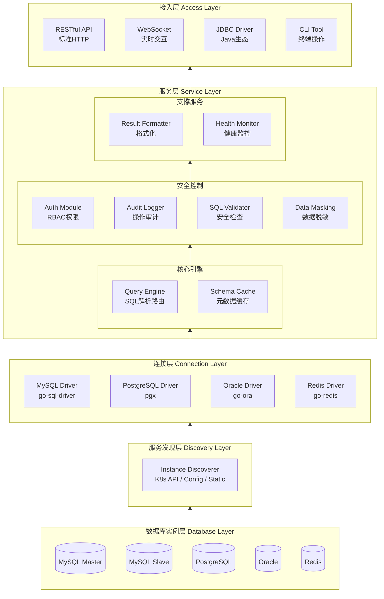
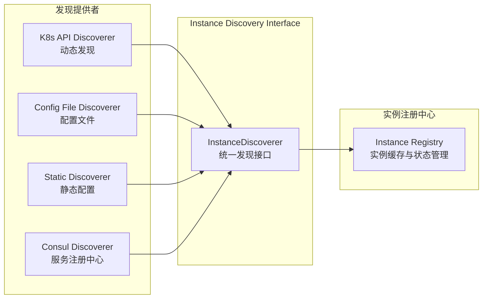
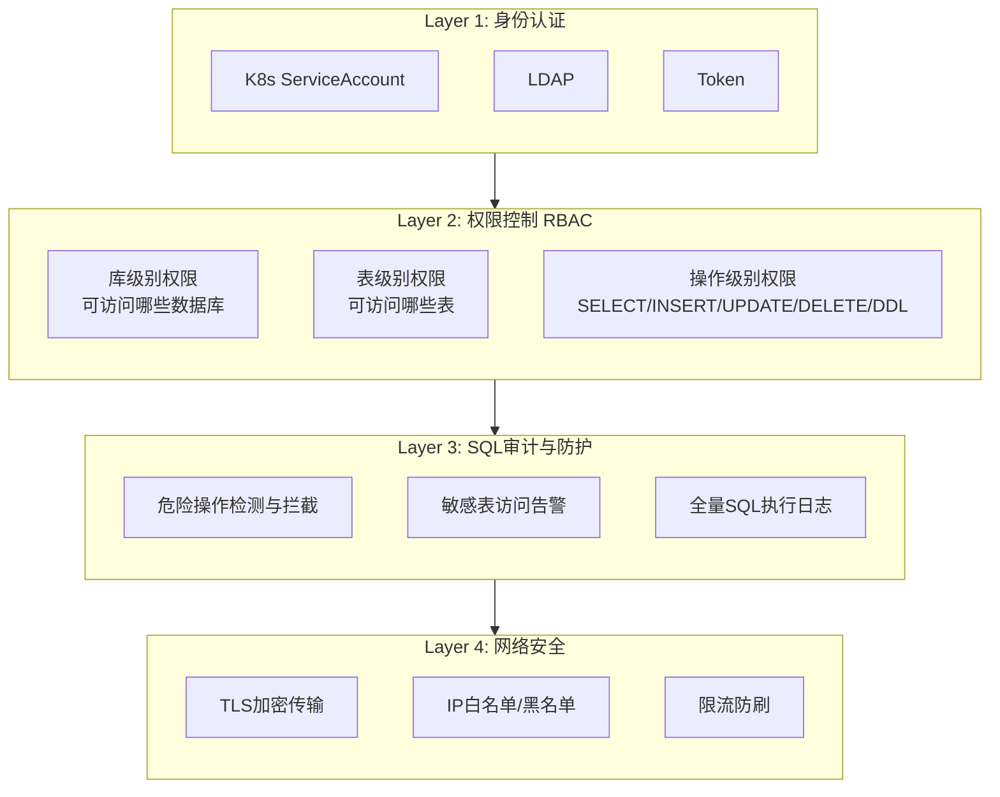
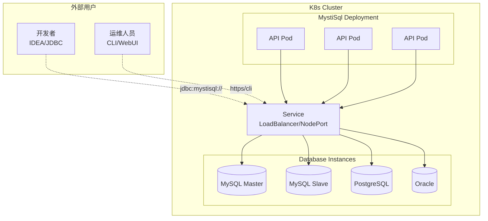

# 架构设计

## 整体架构

> 架构层次从下往上：数据库实例 → 服务发现 → 连接层 → 服务层 → 接入层



## 模块详解

> 模块从底层到上层依次介绍，体现依赖关系

### 1. 数据库实例层 (Database Layer)

最底层，实际的数据库实例：
- MySQL（主库/从库）
- PostgreSQL
- Oracle
- Redis

### 2. 服务发现层 (Discovery Layer)

负责发现和管理数据库实例信息：

**功能列表（从低级到高级）**

| 功能 | 级别 | 说明 |
|-----|------|------|
| 实例注册 | 基础 | 数据库实例信息录入 |
| 实例发现 | 基础 | 支持K8s API / 配置文件 / 静态配置 / 服务注册中心 |
| 状态监控 | 中级 | 实例健康状态检查 |
| 动态感知 | 高级 | 实例增删改的实时通知 |

**发现接口设计**



**发现模式详解**

| 模式 | 说明 | 适用场景 |
|-----|------|---------|
| **K8s API动态发现** | 通过client-go监听Service/Pod变化，自动发现带特定Label的数据库实例 | K8s原生环境，实例动态变化 |
| **配置文件发现** | 从ConfigMap/配置文件读取数据库实例列表 | 实例相对固定，需要精细控制 |
| **静态配置发现** | 启动参数或环境变量指定实例 | 单实例或少量实例，快速部署 |
| **服务注册中心发现** | 从Consul/Nacos等注册中心获取实例 | 多集群、混合云环境 |

**接口定义（Go伪代码）**

```go
type InstanceDiscoverer interface {
    Name() string
    Discover(ctx context.Context) ([]*DatabaseInstance, error)
    Watch(ctx context.Context) (<-chan DiscoveryEvent, error)
    Stop() error
}

type DatabaseInstance struct {
    Name        string
    Type        DatabaseType
    Host        string
    Port        int
    Labels      map[string]string
    Annotations map[string]string
    Status      InstanceStatus
}

type DiscoveryEvent struct {
    Type     EventType
    Instance *DatabaseInstance
}
```

**配置示例**

```yaml
discovery:
  k8s:
    enabled: true
    namespaces: [default, production, staging]
    selectors:
      - labelSelector: "app=mysql,environment=production"
        type: mysql
      - labelSelector: "app=postgresql"
        type: postgresql
    portMapping:
      mysql: 3306
      postgresql: 5432
      oracle: 1521
      
  config:
    enabled: true
    sources:
      - configMap:
          name: mystisql-instances
          namespace: mystisql
      - file:
          path: /etc/mystisql/instances.yaml
          
  static:
    enabled: false
    instances:
      - name: local-mysql
        type: mysql
        host: localhost
        port: 3306
```

### 3. 连接层 (Connection Layer)

负责与数据库建立和维护连接：

**功能列表（从低级到高级）**

| 功能 | 级别 | 说明 |
|-----|------|------|
| 驱动适配 | 基础 | MySQL/PostgreSQL/Oracle/Redis驱动封装 |
| 连接建立 | 基础 | 创建数据库连接 |
| 连接池管理 | 中级 | 连接复用，避免频繁建立连接 |
| 健康检查 | 中级 | 连接可用性检测，自动重连 |
| 读写分离 | 高级 | 自动识别主从，路由读写请求 |
| 主从切换感知 | 高级 | 感知主从切换，自动更新路由 |

**多数据库驱动支持**

| 数据库 | 驱动 | 说明 |
|-------|------|------|
| MySQL | go-sql-driver/mysql | 官方推荐 |
| PostgreSQL | pgx | 高性能驱动 |
| Oracle | go-ora | 纯Go实现 |
| Redis | go-redis | 官方推荐 |

### 4. 服务层 (Service Layer)

核心业务逻辑处理，按功能分组：

#### 4.1 核心引擎（基础功能）

**Query Engine (查询引擎)**

| 功能 | 级别 | 说明 |
|-----|------|------|
| SQL解析 | 基础 | 解析SQL语句结构 |
| SQL路由 | 基础 | 根据实例名路由到对应数据库 |
| 查询超时控制 | 中级 | 防止长时间运行的查询 |
| 结果集大小限制 | 中级 | 防止返回过多数据 |
| 智能读写分离 | 高级 | 自动识别读写请求，路由到主库/从库 |

**Schema Cache (元数据缓存)**

| 功能 | 级别 | 说明 |
|-----|------|------|
| 表结构缓存 | 基础 | 缓存表结构信息 |
| 索引信息缓存 | 中级 | 缓存索引信息，辅助优化 |
| 缓存失效策略 | 高级 | 表结构变更时自动刷新缓存 |

#### 4.2 安全控制（中级功能）

**Auth Module (认证授权)**

| 功能 | 级别 | 说明 |
|-----|------|------|
| Token认证 | 基础 | 简单的Token验证 |
| K8s ServiceAccount集成 | 中级 | 集成K8s原生认证 |
| LDAP集成 | 中级 | 企业级认证集成 |
| RBAC权限模型 | 高级 | 库级别、表级别、操作级别权限控制 |

**Audit Logger (审计日志)**

| 功能 | 级别 | 说明 |
|-----|------|------|
| SQL执行记录 | 基础 | 记录执行的SQL语句 |
| 操作者信息 | 基础 | 记录谁执行了操作 |
| 敏感操作告警 | 中级 | DROP/TRUNCATE等危险操作告警 |
| 全量审计日志 | 高级 | 完整的操作审计链路 |

**SQL Validator (SQL安全检查)**

| 功能 | 级别 | 说明 |
|-----|------|------|
| 危险操作检测 | 基础 | 检测DROP、TRUNCATE等危险操作 |
| SQL白名单/黑名单 | 中级 | 配置允许/禁止的SQL模式 |
| 注入攻击防护 | 高级 | 检测并拦截SQL注入攻击 |

**Data Masking (数据脱敏)**

| 功能 | 级别 | 说明 |
|-----|------|------|
| 敏感字段识别 | 基础 | 识别手机号、身份证等敏感字段 |
| 规则脱敏 | 中级 | 按规则进行数据脱敏 |
| 基于角色的脱敏策略 | 高级 | 不同角色看到不同程度的脱敏数据 |

#### 4.3 支撑服务（高级功能）

**Result Formatter (结果格式化)**

| 功能 | 级别 | 说明 |
|-----|------|------|
| 基础格式化 | 基础 | 表格、JSON、CSV格式输出 |
| 分页处理 | 中级 | 大结果集分页返回 |
| 导出功能 | 高级 | 导出为Excel、SQL等格式 |

**Health Monitor (健康监控)**

| 功能 | 级别 | 说明 |
|-----|------|------|
| 连接数监控 | 基础 | 监控数据库连接数 |
| 慢查询捕获 | 中级 | 捕获执行时间超过阈值的SQL |
| 异常告警 | 高级 | 连接池耗尽、磁盘空间不足等告警 |
| 优化建议 | 高级 | 基于慢查询提供索引优化建议 |

### 5. 接入层 (Access Layer)

最上层，面向用户的访问入口：

**功能列表（从低级到高级）**

| 功能 | 级别 | 说明 |
|-----|------|------|
| RESTful API | 基础 | 标准HTTP接口，OpenAPI文档 |
| CLI Tool | 基础 | 终端命令行工具，支持脚本化 |
| WebSocket | 中级 | 实时交互，长连接支持 |
| JDBC Driver | 高级 | Java生态无缝集成，IDEA直连 |
| WebUI | 高级 | 可视化操作界面 |

**各接入方式详解**

| 接入方式 | 协议 | 适用场景 | 特点 |
|---------|------|---------|------|
| RESTful API | HTTP/HTTPS | 系统集成、脚本调用 | 标准化、易集成 |
| CLI Tool | 命令行 | 运维操作、自动化脚本 | 轻量、可编程 |
| WebSocket | WS/WSS | WebUI实时交互 | 低延迟、双向通信 |
| JDBC Driver | JDBC | Java应用、IDEA连接 | 透明代理、无感知 |
| WebUI | HTTP/WS | 可视化操作 | 友好界面、功能丰富 |

**JDBC连接示例**

```java
String url = "jdbc:mystisql://gateway-host:port/database-instance";
Connection conn = DriverManager.getConnection(url, "user", "password");
```

## 安全架构



## 技术栈

| 模块 | 技术选型 | 说明 |
|-----|---------|------|
| Web框架 | Gin / Fiber | 高性能HTTP框架 |
| 数据库驱动 | go-sql-driver/mysql, pgx, go-ora | 官方/社区维护 |
| K8s集成 | client-go | 官方SDK |
| WebSocket | gorilla/websocket | 成熟稳定 |
| CLI框架 | cobra + viper | 命令行标准组合 |
| 权限控制 | casbin | 强大的访问控制库 |
| 日志 | zap | 结构化日志 |
| 缓存 | go-cache / ristretto | 元数据缓存 |

## 产品特性

### 1. 智能SQL路由
- 自动识别读写请求，路由到主库/从库
- 支持分库分表场景的透明访问

### 2. 查询历史与收藏
- 保存常用SQL查询
- 支持分享SQL片段给团队成员

### 3. 数据脱敏预览
- 敏感字段自动脱敏显示
- 基于角色的脱敏策略

### 4. 慢查询分析
- 自动捕获执行时间超过阈值的SQL
- 提供优化建议

### 5. 数据库健康看板
- 实时展示连接数、QPS、慢查询Top10
- 异常告警

### 6. 高可用架构
- 智能读写分离（自动识别主从，路由读写请求）
- 多种负载均衡策略（轮询、权重、最少连接）
- 主从切换感知（自动更新路由）
- 从库延迟检测（延迟过大自动切换到主库）
- 多集群管理（跨集群实例统一管理）

## 部署架构


