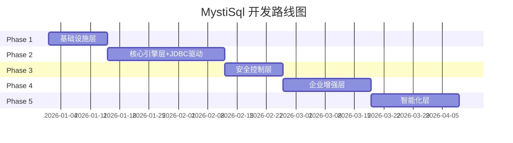

# 开发路线

> 按照从底层到上层、从基础功能到高级功能的顺序规划，JDBC驱动作为核心接入能力优先实现

## Phase 1: 基础设施层 (Infrastructure) ✅ 已完成

**目标**：建立最底层的基础能力，实现数据库实例发现和连接

### 1.1 服务发现层 - 基础功能
- [x] 实例注册接口（手动添加数据库实例）
- [x] 静态配置发现（从配置文件读取实例列表）
- [x] 实例信息存储（内存/文件）

### 1.2 连接层 - 基础功能
- [x] MySQL驱动集成（go-sql-driver/mysql）
- [x] 连接建立（基础连接功能）
- [x] 连接配置管理（host、port、username、password）

### 1.3 接入层 - 基础功能
- [x] RESTful API框架搭建（Gin）
- [x] 健康检查接口
- [x] CLI基础框架（cobra）

**交付物**：能够通过配置文件添加MySQL实例，通过API/CLI连接并执行简单SQL

---

## Phase 2: 核心引擎层 + JDBC驱动 (Core Engine & JDBC) ✅ 已完成

**目标**：实现SQL查询的核心处理能力，**同时发布JDBC驱动**，让用户可以在DataGrip、DBeaver等工具中使用

### 2.1 服务发现层 - 中级功能
- [x] K8s API动态发现（client-go）
- [x] ConfigMap配置源支持
- [x] 实例状态监控（健康检查）

### 2.2 连接层 - 中级功能
- [x] 连接池管理（连接复用）
- [x] 连接健康检查
- [x] 自动重连机制

### 2.3 服务层 - 核心引擎
- [x] SQL解析（基础SQL语法解析）
- [x] SQL路由（根据实例名路由）
- [x] 查询超时控制
- [x] 结果集大小限制
- [x] 表结构缓存（Schema Cache）

### 2.4 接入层 - 基础功能完善
- [x] SQL执行接口（POST /api/v1/query）
- [x] 实例列表接口（GET /api/v1/instances）
- [x] CLI查询命令（mystisql query）

### 2.5 JDBC驱动 - 核心功能 ⭐P0
- [x] JDBC Driver基础框架（实现Driver接口）
- [x] Connection连接实现（连接MystiSql Gateway）
- [x] Statement/PreparedStatement实现（SQL执行）
- [x] ResultSet结果集实现（结果返回）
- [x] DatabaseMetaData实现（元数据查询，支持IDE工具识别）
- [x] 连接URL格式：`jdbc:mystisql://gateway-host:port/database-instance`

**交付物**：
- 完整的SQL查询能力，支持K8s动态发现，连接池管理
- **JDBC驱动发布**，可在DataGrip、DBeaver、SQuirreL等工具中使用

---

## Phase 3: 安全控制层 (Security) ✅ 已完成

**目标**：实现企业级安全控制能力

### 3.1 服务层 - 安全控制
- [x] Token认证（JWT HS256签名）
- [x] SQL执行记录（审计日志基础）
- [x] 危险操作检测（DROP、TRUNCATE拦截）
- [x] SQL白名单/黑名单（正则匹配）

### 3.2 接入层 - 中级功能
- [x] WebSocket支持（实时交互）
- [x] CLI认证集成（auth子命令）
- [x] API认证中间件（Gin中间件）

### 3.3 连接层 - 扩展
- [x] PostgreSQL驱动支持（pgx）
- [x] 多数据库类型路由（根据type字段）

### 3.4 JDBC驱动 - 增强
- [x] JDBC连接池支持（HikariCP兼容）
- [x] 事务支持（begin/commit/rollback API）
- [x] 批量操作支持（POST /api/v1/batch）
- [x] 认证集成（Token传递）

**交付物**：具备安全控制能力的数据库访问网关，JDBC驱动功能完善

---

## Phase 4: 企业增强层 (Enterprise) ✅ 已完成

**完成度**: 28/28 任务 (100% 完成)
**核心特性**: 高可用架构、企业级安全、完整接入

### 4.1 服务发现层 - 高级功能
- [x] 实例动态感知（Watch机制）
- [x] 服务注册中心发现（Consul/Nacos)
- [x] 多集群实例管理

### 4.2 连接层 - 高级功能
- [x] 读写分离（主从路由）
- [x] 主从切换感知

### 4.3 服务层 - 安全增强
- [x] Token认证（JWT HS256签名）
- [x] 审计日志基础（JSON Lines格式、日志轮转）
- [x] SQL安全检查（危险操作检测）
- [x] SQL白名单/黑名单（正则匹配）
- [x] **审计日志增强** ✅ **已完成**
  - 敏感操作自动标记
  - 增强日志字段（会话ID、SQL类型、客户端详细信息）
  - 多维度筛选（用户/实例/SQL类型/敏感操作）
  - 审计统计接口（按用户/实例/时间聚合）

### 4.4 接入层 - 高级功能
- [x] WebUI基础界面 ✅
  - 登录页面 (Token/LDAP)
  - 实例列表页面 (显示实例状态)
  - SQL 查询页面 (Monaco Editor + 语法高亮)
  - 结果展示组件 (表格、分页、排序、导出)
- [x] 审计日志增强 ✅
  - 敏感操作标记显示
  - SQL 类型筛选
  - 审计统计接口
- [x] Oracle驱动支持（go-ora）
- [x] Redis驱动支持（go-redis）

**交付物**：企业级数据库访问平台
支持多数据库、完整安全控制、高可用架构

---

## Phase 5: 智能化层 (Intelligence)

**目标**：智能化运维和高级用户体验

### 5.1 服务层 - 支撑服务
- [ ] 结果格式化（JSON/CSV/Table）
- [ ] 分页处理
- [ ] 导出功能（Excel/SQL）
- [ ] 连接数监控
- [ ] 慢查询捕获
- [ ] 异常告警
- [ ] 优化建议（索引推荐）

### 5.2 服务层 - 高级安全
- [ ] 基于角色的脱敏策略
- [ ] 完整审计链路

### 5.3 接入层 - 高级功能
- [ ] WebUI完整功能
- [ ] 查询历史与收藏
- [ ] 数据库健康看板
- [ ] Redis驱动支持（go-redis）

**交付物**：智能化数据库运维平台

---

## 开发路线图



## 功能优先级矩阵

| 优先级 | 功能 | 阶段 | 价值 |
|-------|------|------|------|
| **P0** | MySQL连接、静态配置发现、RESTful API | Phase 1 | MVP核心 |
| **P0** | SQL解析路由、连接池 | Phase 2 | 核心能力 |
| **P0** | **JDBC驱动（核心功能）** | Phase 2 | **IDE工具集成** |
| P1 | K8s动态发现、Token认证、审计日志 | Phase 2-3 | 生产可用 |
| P1 | PostgreSQL支持、WebSocket | Phase 3 | 多数据库 |
| P1 | JDBC驱动增强（连接池、事务） | Phase 3 | JDBC完善 |
| P2 | RBAC权限、读写分离、WebUI | Phase 4 | 企业级 |
| P2 | LDAP、数据脱敏、Oracle支持 | Phase 4 | 安全合规 |
| P3 | 慢查询分析、健康看板 | Phase 5 | 智能化 |
| P3 | 优化建议、Redis支持 | Phase 5 | 高级特性 |

## 里程碑

| 里程碑 | 阶段完成 | 核心能力 | 状态 |
|-------|---------|---------|------|
| **M1** | Phase 1 | 可连接MySQL执行SQL | ✅ 已完成 |
| **M2** | Phase 2 | **JDBC驱动发布**、K8s动态发现、连接池、完整查询能力 | ✅ 已完成 |
| **M3** | Phase 3 | 安全认证、审计日志、PostgreSQL支持、WebSocket、JDBC增强 | ✅ 已完成 |
| **M4** | Phase 4 | 企业级权限、读写分离、WebUI上线、高可用架构 | ✅ 已完成 |
| **M5** | Phase 5 | 智能化运维平台 | 📋 规划中 |

## 功能规格 (OpenSpec)

项目使用 OpenSpec 管理功能规格，所有规格定义在 `openspec/specs/` 目录：

| 类别 | 规格 | 描述 |
|------|------|------|
| **数据库连接** | mysql-connection | MySQL 连接和查询 |
| | postgresql-driver | PostgreSQL 驱动支持 |
| **REST API** | rest-api | RESTful API 端点 |
| | websocket-support | WebSocket 实时交互 |
| **安全认证** | token-auth | JWT Token 认证 |
| | api-auth-middleware | API 认证中间件 |
| | cli-auth | CLI 认证集成 |
| **审计验证** | audit-logging | 审计日志记录 |
| | sql-validator | SQL 安全检查 |
| | sql-whitelist-blacklist | SQL 白名单/黑名单 |
| **JDBC** | java-jdbc-driver | Java JDBC 驱动 |
| | jdbc-transaction | JDBC 事务管理 |
| | jdbc-batch-operations | JDBC 批量操作 |
| | jdbc-prepared-statement | JDBC 预编译语句 |
| | jdbc-metadata | JDBC 元数据 |
| | jdbc-api-client | JDBC API 客户端 |
| **WebUI** | webui-interface | WebUI 界面 |
| | webui-login | 登录页面 |
| | webui-instances | 实例列表页面 |
| | webui-sql-editor | SQL 查询页面 |
| | webui-result-display | 结果展示组件 |
| | webui-audit-logs | 审计日志页面 |
| | audit-stats-api | 审计统计接口 |
| **基础设施** | config-management | 配置管理 |
| | instance-discovery-static | 静态实例发现 |
| | directory-structure | 目录结构 |

## Phase 3: 安全控制层 - 实现完成 ✅

**完成度**: 112/112 任务 (100%) - **全部功能已完成**

### 已实现的功能模块

**1. Token 认证机制** ✅
- JWT Token 生成和验证 (HS256签名)
- Token 黑名单管理
- REST API: POST/DELETE/GET /api/v1/auth/token
- CLI auth 子命令: token, revoke, info

**2. 审计日志系统** ✅
- 异步日志写入 (buffered channel)
- 日志轮转机制 (按天轮转，保留30天)
- 结构化日志格式 (JSON Lines)
- REST API: GET /api/v1/audit/logs

**3. SQL 安全检查** ✅
- 危险操作检测 (DROP、TRUNCATE、无WHERE的DELETE/UPDATE)
- SQL 白名单/黑名单 (正则匹配)
- 优先级逻辑 (黑名单优先)
- 配置热更新

**4. API 认证中间件** ✅
- Gin 认证中间件
- 白名单路径配置 (/health 无需认证)
- 用户信息注入到 gin.Context
- 认证失败日志记录

**5. PostgreSQL 驱动支持** ✅
- PostgreSQL Connection 实现 (pgx驱动)
- ConnectionPool 管理
- 多数据库类型路由 (根据 instance.type 选择驱动)
- PostgreSQL 特有配置 (sslmode, connectTimeout)

**6. WebSocket 实时交互** ✅
- WebSocket 握手处理器 (Token认证)
- 消息格式定义 (JSON)
- 连接管理 (最大连接数、空闲超时、并发查询限制)
- 心跳机制 (ping/pong)

**7. JDBC 事务管理** ✅
- 事务上下文管理 (connectionId绑定)
- REST API: begin/commit/rollback
- 事务超时自动回滚
- 事务隔离级别配置

**8. JDBC 批量操作** ✅
- 批量 SQL 执行器 (INSERT/UPDATE/DELETE)
- 混合批处理支持
- 批量操作大小限制 (默认1000)
- REST API: POST /api/v1/batch

### 新增 API 端点

**认证相关**:
- `POST /api/v1/auth/token` - 生成 Token
- `DELETE /api/v1/auth/token` - 撤销 Token
- `GET /api/v1/auth/tokens` - 查询 Token 列表

**审计日志**:
- `GET /api/v1/audit/logs` - 查询审计日志

**SQL 验证器**:
- `PUT /api/v1/validator/whitelist` - 更新白名单
- `PUT /api/v1/validator/blacklist` - 更新黑名单

**WebSocket**:
- `ws://host:port/ws` - WebSocket 端点

### 代码统计

| 类别 | 数量 |
|------|------|
| 功能规格 (OpenSpec) | 28 个 |
| 源代码文件 | 60+ 个 |
| 测试文件 | 25+ 个 |
| 代码总行数 | ~15,000 行 |

### 生产就绪度

| 功能模块 | 完成度 | 生产就绪 | 测试覆盖 |
|---------|--------|---------|---------|
| Token 认证 | 100% | ✅ 是 | ✅ 完整 |
| 审计日志 | 100% | ✅ 是 | ✅ 完整 |
| SQL 验证 | 100% | ✅ 是 | ✅ 完整 |
| 认证中间件 | 100% | ✅ 是 | ✅ 完整 |
| PostgreSQL | 100% | ✅ 是 | ✅ 完整 |
| WebSocket | 100% | ✅ 是 | ✅ 完整 |
| JDBC 事务 | 100% | ✅ 是 | ✅ 完整 |
| JDBC 批量操作 | 100% | ✅ 是 | ✅ 完整 |
| CLI 认证 | 100% | ✅ 是 | ✅ 完整 |

**总体生产就绪度**: **100%** - Phase 3 全部功能已就绪

## JDBC驱动使用场景

JDBC驱动发布后，用户可以在以下工具中直接使用MystiSql：

| 工具 | 使用场景 | 优势 |
|-----|---------|------|
| **DataGrip** | 开发调试 | 无需配置port-forward，直接连接K8s数据库 |
| **DBeaver** | 数据管理 | 统一管理多个K8s数据库实例 |
| **SQuirreL SQL** | 通用SQL客户端 | 跨平台支持 |
| **JMeter** | 性能测试 | 直接对K8s数据库进行压测 |
| **自定义Java应用** | 业务集成 | 应用层透明访问K8s数据库 |

**连接示例**：
```java
// DataGrip / DBeaver 配置
String url = "jdbc:mystisql://mystisql-gateway.example.com:3306/production-mysql";
String user = "your-username";
String password = "your-token";

Connection conn = DriverManager.getConnection(url, user, password);
Statement stmt = conn.createStatement();
ResultSet rs = stmt.executeQuery("SELECT * FROM users LIMIT 10");
```
